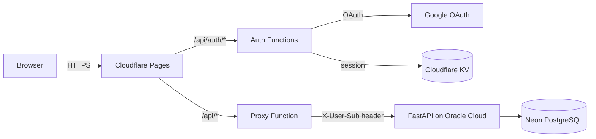

# 🏆 World Cup 2026 Predictions Dashboard

A full-stack web app to predict, track, and compete on FIFA World Cup 2026 match results. Features a glassmorphic UI, dynamic knockout bracket generation, community prediction aggregates, and a decoupled FastAPI backend.

## ⚡ Tech Stack

### Backend
- **Framework**: FastAPI (Python 3.13)
- **Database**: PostgreSQL (Docker locally, Neon in production)
- **ORM & Migrations**: SQLAlchemy + Alembic
- **Package Manager**: `uv`
- **Caching**: In-process TTL caches for user stats, matches, and community data

### Frontend
- **Framework**: Vanilla JS + Vite
- **Styling**: Pure CSS (glassmorphism, CSS variables, responsive Flexbox/Grid)
- **i18n**: Client-side translations (English & Spanish)
- **PWA**: Web app manifest, installable icons, Apple touch icon
- **Flags**: SVG flags via [FlagCDN](https://flagcdn.com)

### Authentication & Proxy
- **Auth**: Google OAuth 2.0 with server-side sessions stored in **Cloudflare KV**
- **API Proxy**: Cloudflare Pages Functions (`frontend/functions/`) inject a trusted `X-User-Sub` header on every authenticated request to the backend

### Infrastructure
| Environment | Frontend | Backend | Database |
|---|---|---|---|
| **Production** | Cloudflare Pages | Oracle Cloud (Docker + NGINX) | Neon (managed PostgreSQL) |
| **Local** | Vite / Docker | FastAPI via Docker Compose | PostgreSQL via Docker Compose |

---

## 📱 Features

### Match Predictions
- Browse all 72 group-stage fixtures across Groups A–L, plus knockout rounds (R32 → Final)
- Filter by group, stage, or prediction status (with / without prediction)
- Submit exact-score predictions locked at kickoff
- Button-based score selectors with penalty-shootout winner selection for knockout draws
- Live group standings blended from confirmed results and your predictions

### Knockout Bracket
- Full interactive bracket with FIFA 2026 Annex C third-place team resolution
- Teams resolve dynamically from your group-stage predictions
- Invalid-prediction detection when bracket teams change after you predict

### Leaderboard & Profiles
- Global leaderboard with rank, points, exact scores, and correct outcomes
- Public user profiles at `#/user/:username` (predictions visible only after match kickoff)
- Personal profile page with stats and prediction history

### Community
- Aggregated crowd predictions: average scores, win/draw/loss percentages per match
- Create private communities with invite links (`#/join/:code`) and scoped leaderboards
- Community virtual user scored from rounded average predictions

### Admin
- Admin dashboard (gear icon) to enter final scores and advance knockout stages
- Admins auto-assigned at registration via `ADMIN_EMAILS` or `ADMIN_GOOGLE_SUBS`

### Localization & UX
- English / Spanish UI with in-navbar language switcher
- Translated team names and all user-facing strings
- Mobile-optimized leaderboard, community, and admin layouts
- Installable PWA on supported devices

### Scoring
| Points | Condition |
|---|---|
| **5** | Exact scoreline |
| **3** | Correct outcome + correct goal difference |
| **1** | Correct outcome (win / draw / loss) |

---

## 🏗️ Architecture



1. The user signs in via Google OAuth; a session ID is stored in Cloudflare KV and set as an `HttpOnly` cookie.
2. All `/api/*` requests (except `/api/auth/*`) pass through the Cloudflare proxy function, which resolves the session and forwards the request to the backend with `X-User-Sub` / `X-User-Email` headers.
3. The FastAPI backend trusts these headers because they are set server-side by Cloudflare, never by the browser.

---

## 🛠️ Prerequisites

- **Docker** and **Docker Compose** (for local backend + database)
- **Node.js 20+** (optional, for running the Vite dev server)
- **Google Cloud Console** project with OAuth 2.0 credentials (for production auth)
- **Cloudflare** account with Pages, KV namespace, and Functions (for production frontend + auth)

---

## 🔐 Environment Variables

### Local development (`.env` at project root)

```env
# PostgreSQL (Docker Compose)
POSTGRES_USER=admin
POSTGRES_PASSWORD=admin
POSTGRES_DB=wc_db
DATABASE_URL=postgresql://admin:admin@db:5432/wc_db

# Admin access (comma-separated, applied at user registration)
ADMIN_EMAILS=you@example.com
ADMIN_GOOGLE_SUBS=          # optional: Google sub IDs

# Local simple auth — two fixed users (admin + test), no Google. Local only.
LOCAL_AUTH=1               # backend: dev auth middleware + /api/auth/* router
VITE_LOCAL_AUTH=1          # frontend build: render admin/test login buttons
```

A ready-to-copy [`.env.example`](.env.example) is included.

> **Note:** Full Google OAuth login only works when deployed to Cloudflare Pages (Functions + KV). For local development, `LOCAL_AUTH`/`VITE_LOCAL_AUTH` (enabled by default in `docker-compose.yml`) replace Google with a simple two-user login — see [Local login](#-running-locally) below. These flags are never set in production, so the deployed Cloudflare/Oracle/Neon stack is unaffected.

### Production — Backend (Oracle Cloud)

```
DATABASE_URL          # Neon PostgreSQL connection string
ADMIN_EMAILS          # Comma-separated admin emails
ADMIN_GOOGLE_SUBS     # Optional comma-separated Google sub IDs
FRONTEND_URL          # Cloudflare Pages URL (for CORS)
```

### Production — Frontend (Cloudflare Pages)

| Variable / Binding | Purpose |
|---|---|
| `GOOGLE_CLIENT_ID` | Google OAuth client ID |
| `GOOGLE_CLIENT_SECRET` | Google OAuth client secret |
| `SESSIONS` (KV binding) | Server-side session storage |

Cloudflare Pages Functions in `frontend/functions/` handle auth and proxy all API traffic to the backend.

---

## 🚀 Running Locally

The app runs via Docker Compose with PostgreSQL, FastAPI, Vite-built frontend, and NGINX on port 80.

```bash
docker compose up -d --build
```

On first boot, Alembic applies migrations and `seed.py` populates 48 teams and 72 group-stage fixtures.

| Service | URL |
|---|---|
| Web app | `http://localhost/` |
| API | `http://localhost/api/` |
| Health check | `http://localhost/api/health` |

To stop:

```bash
docker compose down
```

### Local login (no Google)

With `LOCAL_AUTH`/`VITE_LOCAL_AUTH` enabled (the default locally), the login page
shows two buttons instead of Google:

- **Login as Admin** — user `admin`, granted admin rights (gear icon / admin dashboard).
- **Login as Test user** — user `test`, a regular player.

Both accounts are created automatically on first login (no onboarding step). This is
implemented entirely in `backend/app/local_auth.py` (a dev-only middleware that injects
the same `X-User-Sub` header Cloudflare sets in production) and a `VITE_LOCAL_AUTH`-gated
branch in `frontend/src/pages/login.js`. None of it runs in production.

### Populating test data

Mount scripts are available inside the backend container:

```bash
# Create simulated users with random predictions
docker compose exec backend python simulate_data.py

# Simulate admin-entered results for the first N group matches
docker compose exec backend python simulate_results.py
```

---

## 👤 User Management

### Sign-up flow
1. User signs in with Google → session created in Cloudflare KV.
2. On first visit, unregistered users are redirected to **onboarding** to pick a unique username.
3. `POST /api/users/register` creates the local PostgreSQL profile linked to their Google `sub`.

### Admin access
Admins are granted automatically at registration if their Google email is listed in `ADMIN_EMAILS` or their `sub` is in `ADMIN_GOOGLE_SUBS`. You can also promote a user manually by setting `is_admin = true` in the `users` table.

---

## ☁️ Deployment

| Service | Host | Deploy method |
|---|---|---|
| Frontend | Cloudflare Pages | Auto-deploy on push to `main` |
| Backend | Oracle Cloud Free Tier | Manual: SSH + `./update.sh` |
| Database | Neon | Managed (not affected by deploys) |

### Deploying backend changes

```bash
ssh ubuntu@<your-server-ip>
cd ~/wc-predictions
./update.sh
```

This pulls the latest code and rebuilds the production containers (`docker-compose.prod.yml`). Migrations run automatically via `alembic upgrade head` on container start. Expect ~10–30 seconds of downtime.

### Database management

Connect to Neon with any PostgreSQL client using the `DATABASE_URL` from your server `.env`.

```bash
# Roll back and recreate schema (⚠️ deletes all data)
alembic downgrade base
alembic upgrade head
```

For day-to-day server operations (logs, SSL renewal, restarts), see [MAINTENANCE.md](MAINTENANCE.md).

---

## 📂 Project Structure

```
wc-predictions/
├── backend/
│   ├── app/
│   │   ├── routers/       # API endpoints (matches, predictions, knockout, community, admin…)
│   │   ├── data/          # teams.csv, matches.csv, annex_c.json
│   │   ├── models.py      # SQLAlchemy models
│   │   └── seed.py        # Database seeder
│   ├── alembic/           # Migrations
│   ├── simulate_data.py   # Generate test users + predictions
│   └── simulate_results.py
├── frontend/
│   ├── src/
│   │   ├── pages/         # Route handlers (home, matches, bracket, community…)
│   │   ├── components/    # navbar, matchCard, toast, flags
│   │   └── i18n.js        # EN / ES translations
│   └── functions/api/     # Cloudflare Pages Functions (auth + proxy)
├── nginx/                 # Reverse proxy configs (local + production)
├── docker-compose.yml     # Local full stack
├── docker-compose.prod.yml
├── update.sh              # Production deploy script
└── MAINTENANCE.md         # Server ops guide
```
